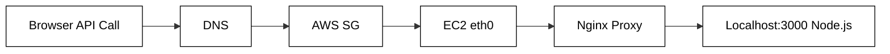

why backend? data

#### Backend API Flow

#### Frontend Asset Flow

from AWS instance POV node server is running in local server; we use nginx domain names to route requests to our local server over internet 

**CORS (Cross-Origin Resource Sharing)** is a browser-enforced security mechanism.
Back then, if you logged into your bank, and visited a malicious site in diff tab, that site's JS could send a request to `yourbank.com/transfer-money` and browser would attach your session cookies! This is called Cross-Site Request Forgery (CSRF).

To prevent this, browsers enacted the Same-Origin Policy. JavaScript running on `evil.com` cannot read data fetched from `api.yourbank.com` unless `api.yourbank.com` explicitly sends back a header saying: `"Hey browser, I trust evil.com, let them read this."` That header is `Access-Control-Allow-Origin`. You configure Nginx or your Node app to send this header to tell the browser who is allowed to talk to your backend.

why not do every action in frontend instead of using backend?
- browsers have restrictive security policies
- CORS (can't use external APIs)
- databases
- computing power
- never trust the client

If your database credentials, proprietary algorithms, or business logic (like checking if a user actually paid for an item) live in the frontend, your application is inherently compromised. The backend exists as a **trusted execution environment**. It is a fortress you control, running on hardware you own (or rent from AWS), where code executes exactly as written without malice or interference.

browser runtimes are sandboxed environments

---
#### Understanding http

- stateless
- client-server model 

self-contained req: since it is stateless each req must have all necessary data (auth token / session info) to handle that specific interaction
benefits: simple + scalable (server doesn't store session info + distribute across several servers)

state management techniques like cookies or sessions to maintain continuity

(client is browser / application that initiates communication by sending req to server and it provides all required info for server; server hosts resources and waits for incoming requests from clients to process and respond)

Historically, http relied on TCP for data transmission; however the modern http/3 uses QUIC, a transport protocol build on top of UDP

>[!tldr]
>Client and Servers establish some kind of are network connection and request / response messages are exchanged. 

http headers are metadata fields sent along to provide context about communication
http methods exist to represent the diff kind of actions that can be req on server
example - get, post, put, patch, delete, options

idempotent: describes property of certain operations where applying them multiple times yields same result as applying them just once
idempotent: get, put, delete; non-idempotent: post, both: patch

options method is used to fetch the capabilities of server for a cross origin req (CORS) which is used because browsers have same origin policy (if our domain and server domain are diff???)

in cors you have primarily two types of flows:
- Simple Request: The browser sends the actual request immediately (e.g., standard `GET` or basic `POST` with `text/plain`) because it poses no security risk to state.
- Preflighted Request: The browser sends an initial `OPTIONS` request _first_ like a scout ("Hey server, do you allow `DELETE` from `my-app.com`?"). Only if the server responds "Yes" does the browser send the actual destructive request

when is preflighted request fired: 
- method is not one of the CORS-safe methods (`GET`, `POST`, or `HEAD`) OR
- includes non-simple headers like auth, x-customer-header OR
- has content-type other than application/x-www-form-urlencoded, multipart/form-data, text/plain 

http response codes exist to communicate result of a req in a standardized way
1xx information, 2xx success, 3xx redirection, 4xx client error, 5xx server error

http caching: storing copies of responses for reuse; (etag, last-modified header), http 304 status
this improves load time, reduces bandwidth, decreases server load

content negotiation: mechanism using which client and sever agree on the best format to exchange data (media, language, encoding and so on)
http compression

persistent connections and keep-alive: 
in early days of http each req-resp cycle required a separate connection now this created inefficiency as establishing and closing tcp connections is resource intensive and slow, to address this persistent connections were introduced; now with this a single tcp connection can be reused for multiple req-resp and for achieving that keep-alive header is used

multipart data and chunked transfer

ssl vs https vs tls
- original encryption between clients and server, currently outdated due to security vulnerabilities
- modern and more secure version of ssl
- https is http + more security which are provided either by tls

---
#### Routing

http methods -> intent / action / what
routing -> where

routing is mapping url parameters to a server-side logic
rest api: sending semantic expressions to api endpoints

- **HTTP/1.1:** Single request per TCP connection. Subject to **Head-of-Line (HOL) Blocking**.
- **HTTP/2:** Multiplexes multiple binary streams over 1 TCP connection. Fixed HTTP HOL blocking, but TCP packet loss still pauses ALL streams (**TCP HOL Blocking**).
- **HTTP/3 (QUIC over UDP):** Runs on UDP. Independent stream handling—a lost packet on Stream A doesn't block Stream B. Combines Transport + TLS 1.3 handshake into **1-RTT / 0-RTT**.

| **Routing Type** | **One-Line Definition**                                                                        | **Real Example**                   | **Best Use Case**                                                       |
| ---------------- | ---------------------------------------------------------------------------------------------- | ---------------------------------- | ----------------------------------------------------------------------- |
| **Static**       | Direct 1:1 mapping between a fixed URL path and a specific handler.                            | `/about`, `/contact-us`            | Fixed application pages or static resources.                            |
| **Path Params**  | Dynamic placeholders embedded inside the URL path structure.                                   | `/users/:userId/posts/:postId`     | Identifying a **specific resource** or entity in a hierarchy.           |
| **Query Params** | Key-value pairs appended after `?` that filter/modify the response.                            | `/products?category=shoes&page=2`  | Filtering, pagination, sorting, or searching collections.               |
| **Nested**       | Hierarchical routing where sub-routes inherit layout or middleware context from parent routes. | `/dashboard/settings/billing`      | Admin panels, scoped middleware (e.g., auth checks on `/dashboard/*`).  |
| **Versioning**   | Prefixing routes or using headers to support legacy clients without breaking changes.          | `/api/v1/users` vs `/api/v2/users` | Public APIs, mobile backends where users don't update apps immediately. |
| **Catch-All**    | A fallback wildcard route (`*`) that matches any undefined path.                               | `app.use('*', custom404Handler)`   | Serving single-page app (SPA) index files or custom 404 error pages.    |

serialization and deserialization: converting data to a common format during transmission or storage so that it is language / domain agnostic
common standard ex) json in textbased serialization and protobuff for binary format
osi model, javascript client vs rust server

--- 

#### Authentication & Authorization

who are you? what can you do?

multifactor auth
- something you know
- something you are 
- something you have

in 21st century where you have cloud computing, mobile devices, api based architectures demanded advanced auth frameworks: oauth 2.0, jwt, zero trust architecture, passwordless

future of auth: decentralized / blockchain, post quantum cryptography 

| Component   | Storage Location     | State Strategy               | Key Trade-off                                                      |
| :---------- | :------------------- | :--------------------------- | :----------------------------------------------------------------- |
| **Session** | DB / Redis           | Stateful (Server lookup)     | Easy instant revocation, but requires DB hit per request.          |
| **JWT**     | Auth Header / Cookie | Stateless (Crypto signature) | Zero DB hits, horizontally scalable, but hard to revoke instantly. |
| **Cookie**  | Browser Storage      | Transport Container          | Use `HttpOnly` (stops XSS) and `SameSite=Strict` (stops CSRF).     |

--- 
#### RPCs vs edge functions

When building an app using a backend-as-a-service like Supabase, need to choose between RPCs (remote procedure calls) and Edge Functions to handle your backend logic.

RPCs = Custom SQL function written directly inside your PostgreSQL database. App calls this function via an API client, executing the database code seamlessly.

> sends a request $\rightarrow$ API gateway routes it directly to the database $\rightarrow$ the database executes the SQL logic and returns the data.

- Pros - blazing fast performance, ACID transactions, strong security (RLS)
- Cons - sql only, no external api interactions (databases are isolated, cannot easily fetch data from a third-party service like stripe), heavy db load (if function does heavy computing (like image processing or intensive text parsing), it consumes core database CPU resources, which can slow down your entire app)

Edge Functions = typescript/js functions distributed globally across a CDN (like cloudflare workers), they run in data centers physically closest to your mobile user.

> user in arctic triggers function $\rightarrow$ runs in arctic data center $\rightarrow$ it talks to central database $\rightarrow$ returns result

- Pros - low latency for ingress, great dx, 3rd-party integrations, offloads db computer
- Cons - network hop problem (main edge function is in arctic, main db hosted in antarctica), cold starts, no direct websockets

---
